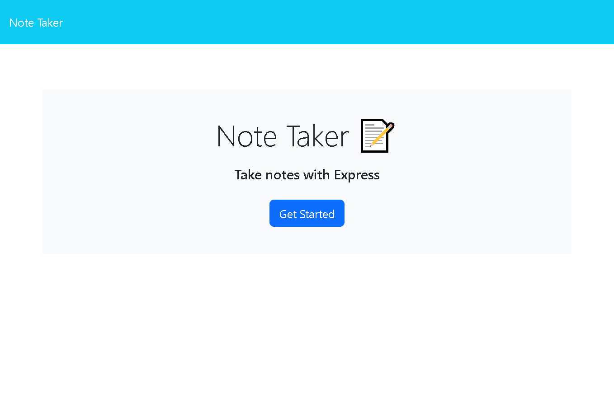

# Notetaker
[Link to my project](https://notetaker-production-3b0a.up.railway.app/)

## Table of Contents
- [Description](#description)
- [Visuals](#visuals)
## Description
    This application is designed to take in user notes, save them to a json file, and keep them organized 
    for later use

## visuals
    